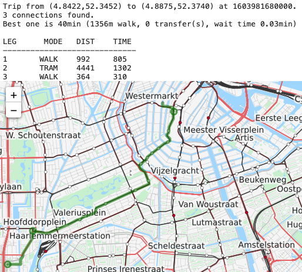
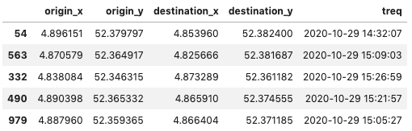
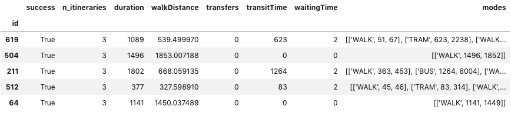

# Public Transport queries

Query public transport connections for set of trip requests (from origin to a destination at given departure time). 

> This python library uses OpenTripPlanner to query single or multiple trips (origin, destination, departure time) for their detailed PT routes. 
>
> It was succesfully applied to query 3 million trips from 6 different cities in one of our research projects.
---

fig.1 Sample query in Amsterdam

 
 fig. 2 Input
 
 
 
 fig.3 Output
 
 
 
 ---

### Input:
 * .csv file with requests [georequests.csv](georequests.csv)
 * .dbf file with OSM network (available e.g. [here](https://www.interline.io/osm/extracts/))
 * .zip with GTFS file for the area and date that we query (available e.g. from [transit.land](https://www.transit.land/))
 * both OSM and GTFS file shall be stored in `data` folder
 
 ### Output:
 * .csv with trip details (time, transfers, modes, wait and walk times, etc.) [georequests_PT.csv](georequests_PT.csv)
 
 
 ### Usage:
 * single trips and visualization in this tutorial [notebook](tutorial.ipynb)
 * running the OTP server [notebook](run_OTP_server.ipynb)
 * bulk queries (up to millions of requests): `python main.py`
 
 
 -----
 (c) Rafał Kucharski, SmartPTLab, TU Delft
 
 
 
